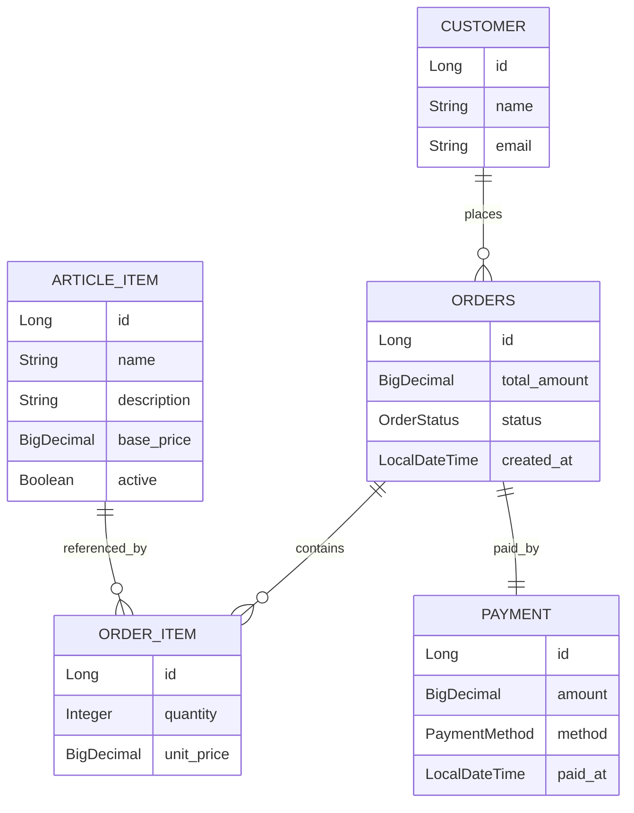

# Order & Payment Service

Un microservizio REST per la gestione di ordini e pagamenti, costruito con **Java 21** e **Spring Boot 4.3**.

Il requisito principale è l'**integrità transazionale**: l'aggiornamento dello stato dell'ordine e l'inserimento del pagamento avvengono in modo atomico, con rollback completo in caso di errore.

---

## Stack Tecnologico

| Dipendenza                    | Versione | Scopo |
|-------------------------------|----------|---|
| Java                          | 21       | Record per i DTO, inferenza `var` |
| Spring Boot                   | 4.0.3    | Auto-configurazione, Tomcat embedded |
| spring-boot-starter-webmvc    | 4.0.3    | Controller REST, serializzazione JSON (Jackson) |
| spring-boot-starter-data-jpa  | 4.0.3    | ORM JPA/Hibernate, Spring Data |
| spring-boot-starter-validation | 4.0.3    | Bean Validation 3.0 |
| H2 Database                   | 2.x      | DB in-memory, console su `/h2-console` |
| Spring Boot Test modules (webmvc-test, data-jpa-test, validation-test)      | 4.0.3    | JUnit 5, Mockito, AssertJ |

---

## Struttura del Progetto

```
src/
├── main/
│   ├── java/com/demo/orderpaymentservice/
│   │   ├── OrderPaymentServiceApplication.java
│   │   ├── controller/
│   │   │   ├── CustomerController.java
│   │   │   └── OrderController.java
│   │   ├── service/
│   │   │   ├── CustomerService.java
│   │   │   └── OrderService.java
│   │   ├── repository/
│   │   │   ├── CustomerRepository.java
│   │   │   ├── ArticleItemRepository.java
│   │   │   ├── OrderRepository.java
│   │   │   └── PaymentRepository.java
│   │   ├── domain/
│   │   │   ├── Customer.java, ArticleItem.java, Order.java
│   │   │   ├── OrderItem.java, Payment.java
│   │   │   ├── OrderStatus.java       (enum: CREATED, PAID, CANCELED)
│   │   │   └── PaymentMethod.java     (enum: CREDIT_CARD, BANK_TRANSFER, CASH)
│   │   ├── dto/
│   │   │   ├── request/   CustomerRequest, OrderRequest, OrderItemRequest, PaymentRequest
│   │   │   └── response/  CustomerResponse, OrderResponse, OrderItemResponse, PaymentResponse
│   │   └── exception/
│   │       ├── NotFoundException.java
│   │       ├── ConflictException.java
│   │       ├── PaymentAmountMismatchException.java
│   │       ├── ErrorResponse.java
│   │       └── GlobalExceptionHandler.java
│   └── resources/
│       ├── application.properties
│       └── data.sql                   (5 articoli di seed)
└── test/
    ├── java/com/demo/orderpaymentservice/
    │   ├── OrderPaymentServiceApplicationTests.java
    │   ├── service/
    │   │   └── OrderServiceTest.java          (10 unit test)
    │   └── integration/
    │       └── OrderIntegrationTest.java      (7 integration test)
    └── resources/
        ├── application.properties
        └── data.sql                           (4 articoli di seed)
```


---

## Architettura

L'applicazione segue una **architettura a livelli (Layered Architecture)**:


Controller → Service → Repository → Database


### Controller
Gestiscono il **layer HTTP**: ricevono le richieste REST, validano l'input e restituiscono le risposte.

### Service
Contengono la **logica di business** dell'applicazione e gestiscono le **transazioni**.

### Repository
Gestiscono l'accesso ai dati utilizzando **Spring Data JPA**.

### Database
Persistenza dei dati tramite **database relazionale** (H2 in-memory per sviluppo e test).

---

### Flusso tipico di una richiesta

1. Il **Controller** riceve la richiesta HTTP.
2. La richiesta viene **validata tramite Bean Validation**.
3. Il **Service** esegue la logica di business.
4. Il **Repository** accede al database tramite JPA.
5. Il risultato viene **convertito in DTO** e restituito al client.


---


---

## Schema ER



### Relazioni principali

- Un **Customer** può avere molti **Orders**
- Un **Order** contiene una o più **OrderItem**
- Ogni **OrderItem** fa riferimento a un **ArticleItem**
- Un **Order** può avere al massimo **un Payment**


## Avvio

### Prerequisiti

- Java 21+
- Maven 3.8+ (oppure usare il wrapper `./mvnw` incluso nel progetto)

### Avviare l'applicazione

```bash
./mvnw spring-boot:run
```

L'applicazione parte su **http://localhost:8080**

Console H2: **http://localhost:8080/h2-console**
- JDBC URL: `jdbc:h2:mem:orderdb`
- Username: `sa` — Password: *(vuota)*

### Eseguire i test

```bash
./mvnw test
```

---

## API

### Customers

| Metodo | Path | Status | Descrizione |
|---|---|---|---|
| `POST` | `/customers` | 201 | Crea un nuovo cliente |
| `GET` | `/customers` | 200 | Lista tutti i clienti |
| `GET` | `/customers/{id}` | 200 | Dettaglio cliente per ID |

### Orders

| Metodo | Path | Status | Descrizione |
|---|---|---|---|
| `POST` | `/orders` | 201 | Crea un nuovo ordine |
| `GET` | `/orders/{id}` | 200 | Dettaglio ordine con righe e pagamento |
| `GET` | `/orders?customerId=&status=` | 200 | Filtra ordini per cliente e/o stato |
| `POST` | `/orders/{id}/pay` | 200 | Paga un ordine (atomico) |
| `POST` | `/orders/{id}/cancel` | 200 | Cancella un ordine |

### Risposta di Errore

Tutti gli errori restituiscono un body JSON uniforme:

```json
{
  "timestamp": "2026-03-13T10:00:00",
  "status": 409,
  "error": "Conflict",
  "message": "Order is already paid: 1",
  "path": "/orders/1/pay"
}
```

| Status | Causa |
|---|---|
| 400 | Fallimento Bean Validation sul body |
| 404 | Cliente, ordine o articolo non trovato |
| 409 | Email duplicata, doppio pagamento, transizione di stato non valida |
| 422 | Importo del pagamento ≠ totale dell'ordine |
| 500 | Errore imprevisto |

---

## Scelte di Design

**Pagamento atomico** — `payOrder()` è `@Transactional`. Quattro controlli vengono eseguiti prima di qualsiasi scrittura su DB: status PAID, status CANCELED, payment già esistente in DB, importo non corrispondente. Se tutti passano, `paymentRepository.save()` e `order.setStatus(PAID)` vengono eseguiti atomicamente.

**Storicizzazione del prezzo** — `unit_price` viene copiato da `article_item.base_price` al momento della creazione dell'ordine. Eventuali variazioni future del catalogo non alterano gli ordini passati.

**compareTo su BigDecimal** — il confronto dell'importo usa `compareTo() != 0` invece di `equals()`. `BigDecimal.equals()` considera la scala: `29.99` e `29.990` sarebbero diversi con `equals`, uguali con `compareTo`.

**Prevenzione N+1** — tutte le relazioni JPA usano `FetchType.LAZY`. Dove serve caricare il dettaglio completo si usa `findByIdWithDetails()`: una singola query JPQL con `JOIN FETCH`.

**Doppia protezione dal doppio pagamento** — garantita a due livelli: applicativo (controllo status + `existsByOrderId`) e database (vincolo `UNIQUE` su `payment.order_id`).

---

## Test rapido con cURL

```bash
# 1. Crea un cliente
curl -X POST http://localhost:8080/customers \
  -H "Content-Type: application/json" \
  -d '{"name": "Mario Rossi", "email": "mario@test.com"}'

# 2. Crea un ordine
curl -X POST http://localhost:8080/orders \
  -H "Content-Type: application/json" \
  -d '{"customerId": 1, "items": [{"articleItemId": 1, "quantity": 1}, {"articleItemId": 2, "quantity": 2}]}'

# 3. Paga l'ordine (totale = 1299.99 + 29.99*2 = 1359.97)
curl -X POST http://localhost:8080/orders/1/pay \
  -H "Content-Type: application/json" \
  -d '{"amount": 1359.97, "method": "CREDIT_CARD"}'

# 4. Doppio pagamento → 409
curl -X POST http://localhost:8080/orders/1/pay \
  -H "Content-Type: application/json" \
  -d '{"amount": 1359.97, "method": "CREDIT_CARD"}'

# 5. Importo errato → 422
curl -X POST http://localhost:8080/orders/1/pay \
  -H "Content-Type: application/json" \
  -d '{"amount": 999.00, "method": "CASH"}'
```

---

## Test

| Classe | Tipo | Test | Note |
|---|---|---|---|
| `OrderPaymentServiceApplicationTests` | Context load | 1 | Il contesto Spring si avvia senza errori |
| `OrderServiceTest` | Unit (Mockito) | 10 | Logica di business, nessun DB coinvolto |
| `OrderIntegrationTest` | Integrazione | 7 | Spring completo + H2, flussi end-to-end |

`@Transactional` sulla classe di integration test garantisce il rollback automatico dopo ogni test, ogni test parte con il DB pulito.
